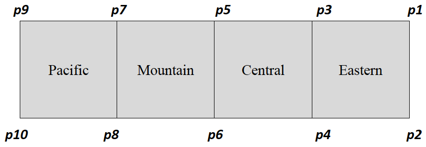

# Sentiment Analysis - CS1026 Assignment 3

## Learning Outcomes

By completing this assignment, you will gain skills relating to

* Using functions
* Complex data structures
* Text processing
* File input and output
* Exceptions in Python
* Using Python modules
* Testing programs and developing test cases; adhering to specifications
* Writing code that is used by other programs.

## Background

With the emergence of Internet companies such as Google, Facebook, and Twitter, more and more data accessible online is comprised of text. Textual data and the computational means of processing it and extracting information is also increasingly more important in areas such as business, humanities, social sciences, etc. In this assignment, you will deal with textual analysis.

Twitter has become very popular, with many people “tweeting” aspects of their daily lives. This “flow of tweets” has recently become a way to study or guess how people feel about various aspects of the world or their own life. For example, analysis of tweets has been used to try to determine how certain geographical regions may be voting – this is done by analyzing the content, the words, and phrases, in tweets. Similarly, analysis of keywords or phrases in tweets can be used to determine how popular or unpopular a movie might be. This is often referred to as sentiment analysis.

## Task

In this assignment, you will write a Python module, called ``sentiment_analysis.py`` (this is the name of the file that you should use) and a main ``program, main.py``, that uses the module to analyze Twitter information. In the module ``sentiment_analysis.py``, you will create a function that will perform simple sentiment analysis on Twitter data. The Twitter data contains comments from individuals about how they feel about their lives and comes from individuals across the continental United States. The objective is to determine which timezone (Eastern, Central, Mountain, Pacific; see below for more information on how to do this) is the “happiest”. To do this, your program will need to:

1. **Analyze each individual** tweet to determine a score – a “happiness score” – for the individual tweet.
2. The “happiness score” for a **single tweet** is found by looking for certain keywords (which are given) in a tweet and for each keyword found in that tweet totaling their “sentiment values”. In this assignment, each value is an integer from 1 to 10.

    **The happiness score for the tweet is simply the sum of the “sentiment values” for keywords found in the tweet divided by the number of keywords found in the tweet. If there are none of the given keywords in a tweet, it is just ignored, i.e., you do NOT count it.**

   To determine the words in a tweet, you should do the following:
   * Separate a tweet into words based on white space. A “word” is any sequence of characters surrounded by white space (blank, tab, end of line, etc.).
   * You should remove any punctuation from the beginning or end of the word (do NOT worry about punctuation within a word). So, “#lonely” would become “lonely” and “happy!!” would become “happy”; but “not-so-happy” is just “not-so-happy”.
   * You should convert the “word” into just **lower case letters**. This gives you a “word” from the tweet.
   * If you match the “word” to any of the sentiment keywords (see below), you add the score of that sentiment keyword to a total for the tweet; **you should just do exact matches.** For example, if the word “hats” is in the tweet and the word “hat” is a sentiment keyword, then they DO NOT MATCH. Of course, if “hats” is in the list of sentiment keywords, then there is a match.

3. For each region, you should count the number of tweets in that region and you should count the number of tweets with keywords – these are called “**keyword tweets**”. A “**keyword tweet**” is a tweet in the region in which there was **at least one matched keyword**. [**Note**: the number of “keyword tweets” is always less than or equal to the total number of tweets in a region].
4. The “happiness score” for a timezone is just the total of the happiness scores for the all the **keyword tweets** in the region divided by the number of **keyword tweets** in that region; again, **if a tweet has NO keywords, then it is NOT to be counted as a “keyword tweet” in that timezone, i.e., it is just skipped as a “keyword tweet” but counted in the total number of tweets in that region.**

    A file called ``tweets.txt`` contains the tweets and a file called ``keywords.txt`` contains keywords and scores for determining the “sentiment” of an individual tweet. These files are described in more detail below.

## File

### tweets.txt

The file ``tweets.txt`` contains the tweets; one per line (some lines are quite long). The format of a tweet is:

```text
    [lat, long] value date time text
```

* [lat, long] - the latitude and longitude of where the tweet originated. You will need these values to determine the timezone in which the tweet originated.
* value – not used; this can be skipped.
* date – the date of the tweet; not used, this can be skipped.
* time – the time of day that the tweet was sent; not used this can be skipped.
* text – the text in the tweet.

### keywords.txt

The file ``keywords.txt`` contains sentiment keywords and their “happiness scores”; one per line. The format of a line is:

```text
    keyword, value
```

* keyword - the keyword to look for.
* value – the value of the keyword; values are from 1 to 10, where 1 represents very “unhappy” and 10 represents “very happy”.

## Determining timezones across the continental United States

Given a latitude and longitude, the task of determining exactly the location that it corresponds to can be very challenging given the geographical boundaries of the United States. For this assignment, we simply approximate the regions corresponding to the timezones by rectangular areas defined by latitude and longitude points. Our approximation looks like: <br>



So, the Eastern timezone, for example, is defined by latitude-longitude points p1, p2, p3, and p4. To determine the origin of a tweet, then, one simply has to determine in which region the latitude and longitude of the tweet belongs. The values of the points are:

```text
    p1 = (49.189787, -67.444574) 
    p2 = (24.660845, -67.444574) 
    p3 = (49.189787, -87.518395) 
    p4 = (24.660845, -87.518395) 
    p5 = (49.189787, -101.998892) 
    p6 = (24.660845, -101.998892) 
    p7 = (49.189787, -115.236428) 
    p8 = (24.660845, -115.236428) 
    p9 = (49.189787, -125.242264) 
    p10 = (24.660845, -125.242264)
```

**Note: if the latitude-longitude of a tweet is outside of all these regions, it is to be skipped; if a tweet is on the border between regions, then choose one of the regions.**

## Functional Specifications

Developing code for the processing of the tweets and sentiment analysis.

1. Your module ``sentiment_analysis.py`` **must include** a function ``compute_tweets`` that has two parameters. The first parameter will be the name of the file with the tweets and the second parameter will be the name of the file with the keywords. This function will use these two files to process the tweets and output the results. This function should also check to make sure that both files exist and if either does not exist, then your program should generate an exception and the function ``compute_tweets`` should return an empty list (see part 1.c below).

    * The function should input the keywords and their “happiness values” and store them in a data structure in your program (the data structure is of your choice).
    * Your function should then process the file of tweets, computing the “happiness score” for each tweet and computing the “happiness score” for each timezone. You will need to read the file of tweets line by line as text and break it apart. The string processing functions in Python are very useful for doing this. Your program should not duplicate code. It is important to determine places that code can be reused and create functions. **Your program should ignore tweets from outside the time zones.**
    * Your function, ``compute_tweets``, should **return a list of tuples**:

      1. The list should contain the results in a tuple for each of the regions, **in order: Eastern, Central, Mountain, Pacific**.
      2. Each tuple should contain three values: (**average, count_of_keyword_tweets, count_of_tweets**), where **average** is the average “happiness value” of that region, **count_of_keyword_tweets** is the number of tweets found in that region with keywords and **count_of_tweets** is the number of tweets found in that region. These values should be in the order specified.
      3. **Note: if there is an exception from a file name that does not exist, then an empty list should be returned**.

2. **Your main program**, ``main.py``, will prompt the user for the name of the two files – the file containing the keywords and the file containing the tweets. It will then call the function ``compute_tweets`` with the two files to process the tweets using the given keywords.

    **Your main program will get the results from compute_tweets and print the results; it should print the results in a readable fashion (i.e., not just numbers).**

3. You are also given a program, ``driver.py``, and some test files. The test files are small files of tweets and keywords that ``driver.py`` uses to test your program – that is, it will import your program, ``sentiment_analysis.py``, and will make use of the function ``compute_tweets``. The files ``tweets1.txt`` and ``tweets2.txt`` are small files with tweets and the files ``key1.txt`` and ``key2.txt`` contain keywords and “happiness values”. The program ``driver.py`` will use these to test your function; these files are small enough that you can compute the results by hand to test your program. You should use the program and these files to test your code. **Note: while ``driver.py`` does some testing, it is your responsibility to design your own test cases to test it thoroughly.**

## Additional Information

For both files, it is advised that when you read in the files you the line below to avoid encoding errors. open("``fileName.txt``","r",encoding="utf-8") or open('``fileName.txt``', encoding='utf-8', errors='ignore').